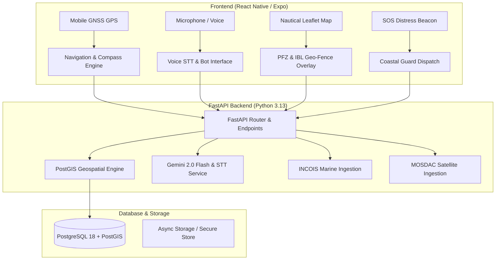

# 🌊 Samudra Kural (சமுத்திரக் குரல்)

> **A Next-Generation Conversational AI & Ocean Intelligence Platform for Fishermen and Coastal Guard Command.**

[](LICENSE)
[](https://fastapi.tiangolo.com)
[](https://reactnative.dev)
[](https://postgis.net)
[](https://deepmind.google/technologies/gemini/)

---

## 📌 Overview

**Samudra Kural** (*Voice of the Ocean*) empowers artisanal and commercial fishermen with life-saving oceanic intelligence, real-time potential fishing zones (PFZ), satellite-derived sea state telemetry, maritime international boundary line (IBL) geo-fencing, and emergency SOS distress broadcast capabilities.

It pairs a high-performance **FastAPI + PostGIS** backend with an intuitive, offline-ready **React Native / Expo** mobile application supporting **10 coastal languages**.

---

## ✨ Key Features

### 1. 🧭 GNSS Vessel Telemetry & Compass Navigation
- **Hardware GPS Integration**: Real-time Speed Over Ground (SOG), Course Over Ground (COG), Distance to Target, and Dynamic Compass Heading.
- **Mathematical Navigation Engine**: Zero-external-dependency Haversine formulas and bearing trigonometry computed on-device and verified by PostGIS.
- **Marine Deep Drop-off Bathymetry**: High-contrast bathymetry contours identifying submarine drop-offs and productive oceanic ridges.

### 2. 🚨 International Maritime Boundary Line (IBL) Geo-Fencing
- **22-Point High-Precision Treaty Coordinate Polygon**: Complete coverage from Palk Strait, Palk Bay, Gulf of Mannar, to the Bay of Bengal.
- **Proximity-Based Adaptive Threat Alerts**:
  - **Safe Waters (`> 5.0 NM`)**: Calm green status for standard voyage operations.
  - **Caution Zone (`2.0 – 5.0 NM`)**: Amber advisory alerting crew of boundary approach.
  - **Critical Zone (`0.3 – 2.0 NM`)**: High-priority alert indicating imminent boundary line.
  - **Boundary Crossed (`≤ 0.3 NM`)**: Emergency audio buzzer & visual turn-back directive.

### 3. 🐟 Real-Time PFZ & Ocean State Intelligence
- **INCOIS Live Feed**: Potential Fishing Zones (PFZ) categorized by SST gradients and chlorophyll-a concentrations.
- **ISRO MOSDAC Satellite Integration**: Live wind speed, significant wave height, swell period, sea surface temperature, and surface currents.
- **Interactive Multi-layer Nautical Map**: Visualizes PFZ polygons, depth contours, marine hazards, and international borders.

### 4. 🗣️ Conversational AI Voice Assistant & Live STT
- **Multilingual Marine Bot**: Powered by **Google Gemini 2.0 Flash** for natural oceanographic advisories and fishing regulations.
- **Real-Time Voice Queries**: Multi-provider Speech-to-Text (STT) supporting Gemini Multimodal Audio and Sarvam AI for regional Indian dialects.
- **Text-to-Speech (TTS)**: Crisp native speech synthesized in regional coastal languages.

### 5. 🛡️ Coastal Guard Emergency Command Center
- **Live SOS Distress Beacon Network**: Transmits instant coordinates, vessel registration, crew count, emergency type (e.g. engine failure, medical, storm distress).
- **Officer Incident Dispatch**: Assign rescue cutters, aircraft, and patrol crafts with real-time status tracking (`DISPATCHED`, `EN_ROUTE`, `ON_SCENE`, `RESOLVED`).
- **Editable Officer & Fisherman Profiles**: Full session persistence for officer credentials, command bases, boat registrations, and emergency contacts.

### 6. 🌐 10 Supported Coastal Indian Languages
- English, தமிழ் (Tamil), తెలుగు (Telugu), മലയാളം (Malayalam), हिन्दी (Hindi), ಕನ್ನಡ (Kannada), मराठी (Marathi), ગુજરાતી (Gujarati), ଓଡ଼ିଆ (Odia), and বাংলা (Bengali).

---

## 🏗️ System Architecture


```mermaid
graph TD
    subgraph Client ["Frontend (React Native / Expo)"]
        A[Mobile GNSS GPS] --> C[Navigation & Compass Engine]
        B[Microphone / Voice] --> D[Voice STT & Bot Interface]
        E[Nautical Leaflet Map] --> F[PFZ & IBL Geo-Fence Overlay]
        G[SOS Distress Beacon] --> H[Coastal Guard Dispatch]
    end

    subgraph Backend ["FastAPI Backend (Python 3.13)"]
        API[FastAPI Router & Endpoints]
        NAV[PostGIS Geospatial Engine]
        AI[Gemini 2.0 Flash & STT Service]
        DATA_INCOIS[INCOIS Marine Ingestion]
        DATA_MOSDAC[MOSDAC Satellite Ingestion]
    end

    subgraph Storage ["Database & Storage"]
        DB[(PostgreSQL 18 + PostGIS)]
        CACHE[Async Storage / Secure Store]
    end

    C --> API
    D --> API
    F --> API
    H --> API
    API --> NAV
    API --> AI
    API --> DATA_INCOIS
    API --> DATA_MOSDAC
    NAV --> DB
```

---

## 🛠️ Technology Stack

| Component | Technology |
| :--- | :--- |
| **Backend Framework** | FastAPI (Python 3.13) + Uvicorn ASGI |
| **Database & GIS** | PostgreSQL 18 + PostGIS Spatial Extension |
| **ORM & Migrations** | SQLAlchemy 2.x (Async) + GeoAlchemy2 + Alembic |
| **Authentication** | JWT (PyJWT), Argon2 (`pwdlib`), Bcrypt |
| **AI & Voice** | Google Gemini 2.0 Flash, Sarvam AI Speech API |
| **Marine Data APIs** | INCOIS SAMUDRA API, ISRO MOSDAC Satellite Portal |
| **Mobile Application** | React Native 0.76 + Expo SDK 52 + TypeScript |
| **Map Rendering** | Leaflet / React Native WebView (Zero-cost, Offline-Ready) |
| **Testing** | Pytest, HTTPX, TypeScript (`tsc`) |

---

## 📡 Core API Summary

| Method | Endpoint | Description |
| :--- | :--- | :--- |
| `POST` | `/api/v1/auth/register` | Register new fisherman user |
| `POST` | `/api/v1/auth/login` | Login and receive JWT access token |
| `GET` | `/api/v1/auth/me` | Fetch authenticated user profile |
| `GET` | `/api/v1/navigation/to-shore` | Compute heading and distance to shore |
| `GET` | `/api/v1/navigation/nearest-location` | Find closest hotspot/port |
| `GET` | `/api/v1/pfz/zones` | Retrieve active INCOIS PFZ hotspots |
| `GET` | `/api/v1/pfz/marine-weather` | Fetch MOSDAC & INCOIS ocean metrics |
| `POST` | `/api/v1/voice/stt` | Live multimodal speech-to-text |
| `POST` | `/api/v1/bot/query` | Gemini AI marine intelligence assistant |
| `GET` | `/api/v1/health` | Comprehensive API & database health check |

---

## 🚀 Getting Started

### Prerequisites
- **Python 3.11+** (Python 3.13 recommended)
- **Node.js 18+** & **npm**
- **PostgreSQL 15+** with **PostGIS** extension
- **Expo CLI** (`npm install -g expo-cli`)

### 1. Clone Repository
```bash
git clone https://github.com/keerthanas03/SamudraKural.git
cd SamudraKural
```

### 2. Backend Setup
```bash
cd backend
python -m venv .venv
source .venv/bin/activate # On Windows: .venv\Scripts\activate
pip install -r ../requirements.txt

# Run migrations
alembic upgrade head

# Start FastAPI server
uvicorn app.main:app --host 0.0.0.0 --port 8000 --reload
```
API Documentation available at: `http://localhost:8000/docs`

### 3. Frontend Setup
```bash
cd ../frontend
npm install

# Start Expo dev server
npm start
```
Scan the QR code with **Expo Go** on Android/iOS or press `w` to run in web browser.

### 4. Running Backend Tests
```bash
cd backend
pytest -v
```

---

## 📄 License
This project is licensed under the [MIT License](LICENSE).
